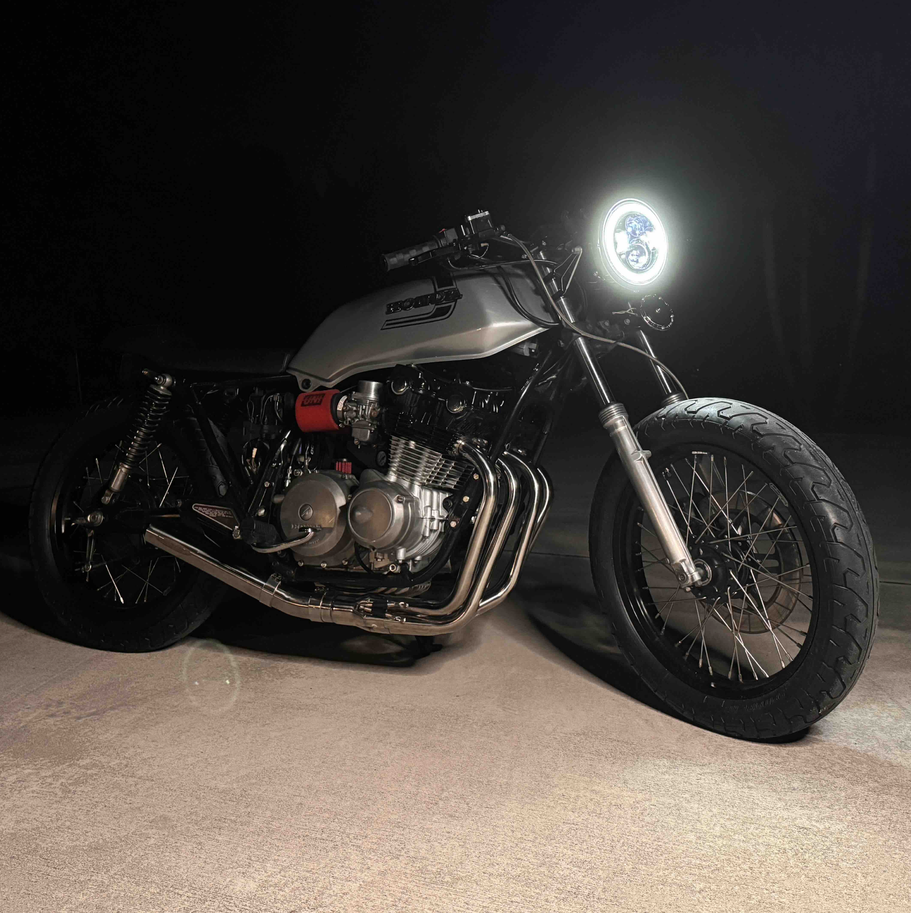
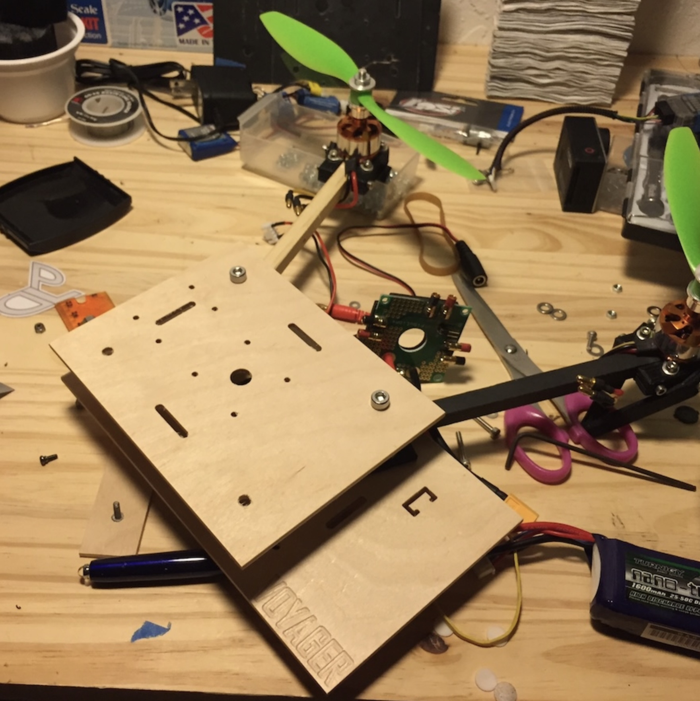
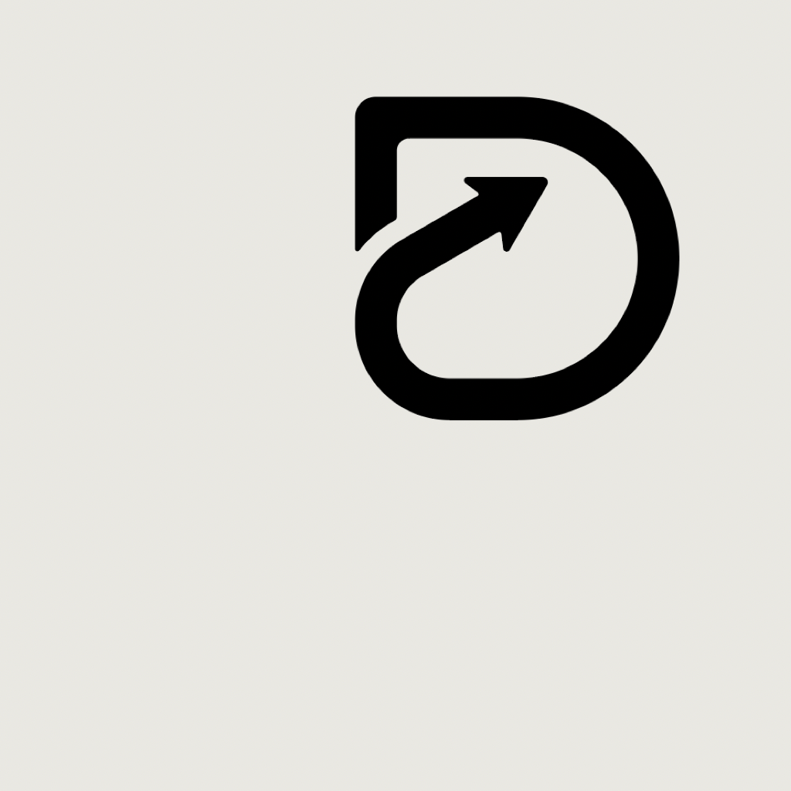

# Hi, I'm Luis 👋

**Founder · iOS Engineer · Multidisciplinary Builder**

I build complete systems — airframe to firmware to production software — and root-cause what breaks. My work spans mobile development, UAVs, geospatial technology, fabrication, and product design.

Right now I'm building **[Detour](https://joindetour.com/)** — a social collection for your favorite spots.

  
  
  
  

 

## 🛰️ What I'm building

**Detour** is an offline-first geospatial iOS app. On the engineering side, I built a geospatial engine that processes **50,000 photo-metadata records in under 60 seconds (~830 records/sec) on mobile hardware** — GPS/EXIF extraction, GeoJSON point-in-polygon matching, and global country/territory detection, all within tight CPU, memory, and battery budgets.

Built with:
`Swift` · `SwiftUI` · `Supabase / PostgreSQL` · `MapKit` · `Core Location` · `GeoJSON`

Most of the hard problems are the same shape: large photo libraries, coordinates matched to geographic boundaries, map-based interfaces, image-loading pipelines, and complex application state.

## 🔧 Beyond software

I design and build physical systems too, and test them in the real world:

- **RC aircraft & flight systems** — 20+ fixed-wing and multirotor builds designed, built, and flown
- **Embedded electronics** — Arduino / AVR, C/C++, sensors, real-time control
- **Fabrication** — CAD, CNC machining (including a CNC-milled quadcopter frame), 3D printing, PCB assembly
- **Mechanical restoration** — full electrical/mechanical rebuilds of vintage motorcycles

I like understanding a system end to end, building a functional prototype, testing it under real conditions, and improving it through iteration.

## 📌 A few things here

- **[World_geolocations-GeoJSON](https://github.com/luisazmouz/World_geolocations-GeoJSON)** — GeoJSON boundaries for every country and territory; the reference layer behind Detour's detection engine.
- **[RTFoam](https://github.com/luisazmouz/RTFoam)** — an AI-assisted design tool for foam RC aircraft.
- **[Arduino-to-RC-Receiver](https://github.com/luisazmouz/Arduino-to-RC-Receiver)** — reading RC receiver channels on an Arduino, the input layer for embedded flight control.

## 🧰 Technologies

`Swift` `SwiftUI` `Supabase` `PostgreSQL` `MapKit` `Core Location` `GeoJSON` `REST APIs`
`JavaScript` `HTML` `CSS` `Arduino` `C++` `CAD` `3D Printing` `CNC`

---

📍 [luisazmouz.com](https://luisazmouz.com) · [LinkedIn](https://linkedin.com/in/luisazmouz)
